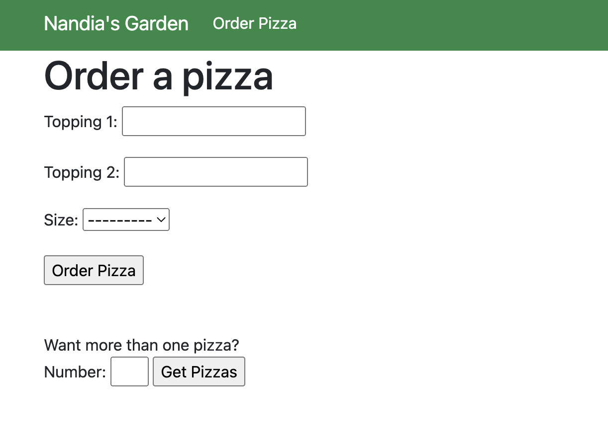
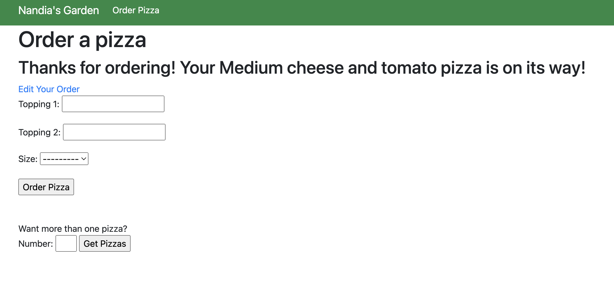
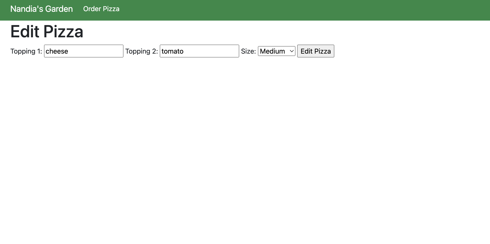

<!-- PROJECT TITLE -->
<br />
<div align="center">

<h2 align="center">DJANGO: Forms</h3>
<p align="center"> Linkedin course offered by Nick Walter</p>
<br />
</div>
<br/>

## About the project

Most websites require the use of forms to receive data from users, so it is crucial to know how to safely collect and handle data while maintaining a user-friendly experience on your website.

This course explains how to deploy forms to your site, access stored data, leverage submitted form data, work with widgets, customize formsets, and more.

<br/><br/>

## Description








<h5>The first image shows the main screen with the Order Pizza button on the Navbar.  The second image shows the order view with two forms. Finally the ordered view with a button 'Edit your order' and the edit view.</h5>

<br/><br/>

## Built with

Major frameworks/libraries used:

  

  

<br/><br/>

## What's included

The structure of the project is as follows:

```
pizza/
├── migrations/
├── static/
│   └── nandiasgarden.jpg
├── templates/
│   └── pizza/
│       ├── base.html
│       ├── edit_order.html
│       ├── home.html
│       ├── order.html
│       └── pizzas.html
├── _init_.py
├── admin.py
├── apps.py
├── forms.py
├── models.py
├── tests.py
├── urls.py
└── views.py

nandiasgarden/
├── _init_.py
├── admin.py
├── asgi.py
├── settings.py
├── urls.py
└── wsgi.py

static/
├── admin/
└── nandiasgarden.jpg

```

<br/><br/>

## Author

I'm Marta Boteller, little more about me at my [website](https://martaboteller.com).
<br/> <br/>

## Acknowledgments

<p>I would like to thank <a href="https://www.linkedin.com/learning/instructors/nick-walter"> Nick Walter</a> for his fantastic way of teaching! </p>
